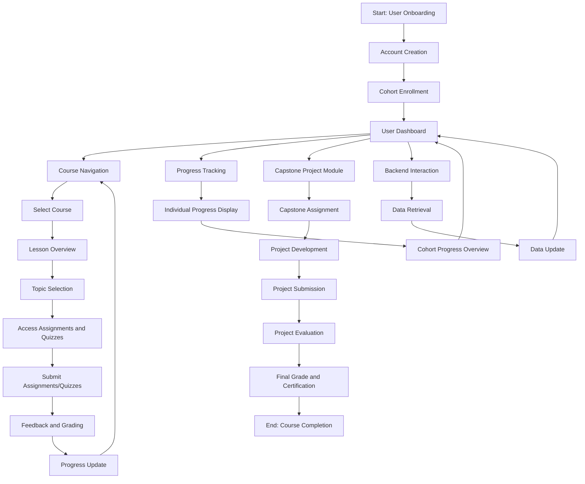
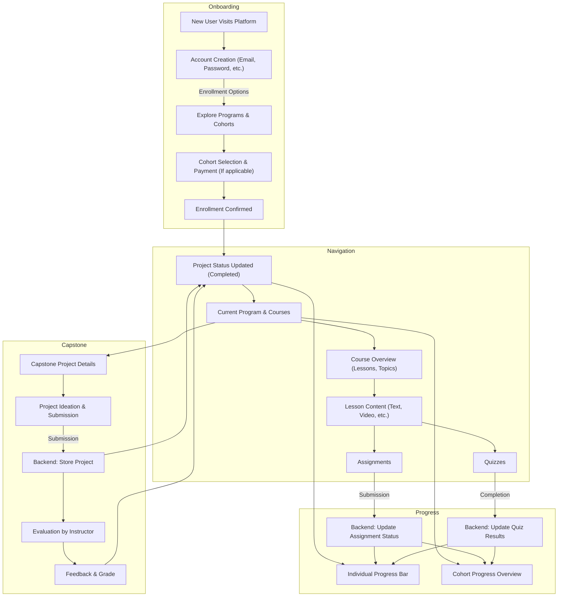

## Application flow
--

### 1. User Onboarding
- **Account Creation**
  - User accesses the platform and selects the option to create a new account.
  - User provides required information (name, email, password) and completes account creation.
- **Cohort Enrollment**
  - User browses available cohorts and selects a suitable one.
  - User enrolls in the cohort, possibly going through a payment process if applicable.

### 2. Course Navigation
- **Accessing Courses**
  - Once enrolled, the user accesses their dashboard showing enrolled courses.
  - User selects a course to start or continue learning.
- **Navigating Lessons and Topics**
  - Within a course, the user navigates through structured lessons and topics.
  - Each topic includes theoretical content, examples, and multimedia resources.
- **Assignments and Quizzes**
  - User accesses and completes assignments and quizzes linked to specific topics.
  - Submissions are made through the platform, and feedback is provided.

### 3. Progress Tracking
- **Individual Progress**
  - The platform tracks the user's progress in lessons and topics, displaying it on the dashboard.
  - Progress indicators include completion status, quiz scores, and assignment feedback.
- **Cohort Progress**
  - Overall cohort progress is also tracked, showing aggregate data on course completion rates and performance.

### 4. Capstone Project Module
- **Assignment**
  - Towards the end of the program, the user is assigned a capstone project.
  - The project requirements and guidelines are provided on the platform.
- **Submission and Evaluation**
  - The user works on the project and submits it through the platform.
  - The submitted project is evaluated by instructors or automated systems, and feedback is provided.

### 5. Interaction with Backend Systems
- **Data Retrieval**
  - Frontend requests data from the backend for course content, user progress, etc.
  - Backend responds with the requested data, which is displayed on the frontend.
- **Data Updates**
  - When the user completes lessons, assignments, or quizzes, this information is sent to the backend.
  - The backend updates the user's progress and returns confirmation to the frontend.


## **Application Flow**
--- 

**1. User Onboarding**

* **Landing Page:** User lands on a page describing your platform and highlighting cohort-based learning. Include calls-to-action like "Explore Programs" and "Sign Up".
* **Account Creation:** New users create accounts (Email, name, basic details).  Authentication can be email/password or integrated with social logins.
* **Cohort Discovery:** Present available cohorts along with program details, schedules, and prerequisites. Consider search/filtering for ease of discovery.
* **Enrollment:** Users select a cohort and proceed with registration, which usually involves payment or an application process if pre-approval is required.

**Backend Interactions:**

* New user records are created in the 'student' table.
* User enrollment creates an entry in the 'student_cohort' junction table.

**2. Course Navigation**

* **Student Dashboard:** Upon login, the dashboard becomes the home base:
    * Cohort overview & timeline
    * Upcoming coursework, deadlines 
    * Direct access to the currently active course/lesson
    * Progress visualization
* **Course Structure:**
    * A clear course outline with expandable modules for each lesson.
    * Within a lesson, logical sequencing of topics.
    * Content presentation (video, text, interactive elements).
* **Assessments:**
    * Assignments and quizzes embedded within relevant topics with clear directions and due dates.

**Backend Interactions**

* Content is accessed from the 'course', 'lesson', 'topic' tables, including assignments and quizzes.

**3. Progress Tracking**

* **Dashboard Elements:**
    *  Completion percentages for lessons/courses 
    *  Cohort's overall progress for comparison
* **Detailed Reports (Accessible to user & potentially staff):**
     * Performance on assessments with the possibility of reviewing answers.

**Backend Interactions**

* Grade and completion data continuously update the 'student_assignment_submission' and 'student_quiz_results' tables.
* Data aggregation to form individual progress reports and cohort-level dashboards.

**4. Capstone Project Module**

* **Introduction:** Provide students with project guidelines, requirements, and potential ideas well within the program.
* **Collaboration Tools (Optional):**  Consider discussion boards, messaging, or even code-sharing tools if collaboration is part of the project.
* **Submission:** Dedicated area for final project upload (files, descriptions, possibly presentations).
* **Evaluation:** A defined process for project review and providing feedback by an instructor or evaluation panel.

**Backend Interaction:**

* Updates 'capstone_project' table on submission, evaluation.

**5. Interaction with Backend Systems**

* **API Driven Interaction:**  A robust REST API will be the bridge between your frontend (React, Angular, Vue, etc.) and the database layer.
* **Data Fetching:** API calls provide course content, assignment/quiz data, cohort info, and project specifications.
* **Updates:** API handles assessment submission, marking completions, and capstone project upload & evaluation.

**Key Design Considerations**

* **Intuitive UI/UX:** Ensure easy navigation and a clear visual sense of progression.
* **Notifications:** Implement reminders and timely notifications for students about deadlines and program updates.
* **Community Elements (Optional):** Consider discussion forums or group chats within the cohort to foster a sense of community and collaboration.


## 1. Flow 



## 2. Flow


## Flow 3
```mermiad
graph TD

%% User Onboarding
subgraph Onboarding
    A["New User Visits Platform"] --> B["Account Creation (Email, Password, etc.)"]
    B -->|Enrollment Options| C["View Available Cohorts / Programs"]
    C --> D["Select Cohort / Program"]
    D --> E["Payment (If applicable)"]
    E --> F["Enrollment Confirmation"] 
end

%% Course Navigation
subgraph CourseExperience
    F --> G["User Dashboard"]
    G --> H["Enrolled Courses"]
    H --> I["Course Overview / Syllabus"] 
    I --> J["Lesson 1"]
    J --> K["Lesson Content (Video/Text)"]
    J --> L["Topic-based Assignments"]
    J --> M["Topic-based Quizzes"]
    K --> L 
    K --> M
end

%% Progress Tracking
subgraph Progress
    G --> N["Individual Progress Meter (Course/Program)"]
    N -->|Updates with actions| K 
    N -->|Updates with actions| L
    N -->|Updates with actions| M
    G --> O["Cohort Progress Dashboard (Admin/Instructor View)"] 
end

%% Capstone Project
subgraph Capstone
    I --> P["Capstone Project Details"]
    P --> Q["Project Submission"]
    Q --> R["Project Evaluation"]
    R --> S["Feedback / Grade"]
    S --> G 
end

%% Backend Interactions (Simplified)
subgraph Backend
    A -->|User data| DB["User Database"]
    C -->|Cohorts| DB
    E -->|Payment info| DB
    H -->|Course Data| DB
    K -->|Content Retrieval| DB
    L -->|Submit Assignment| DB
    M -->|Submit Quiz| DB
    Q -->|Project File| DB 
end
```


# Remix

This directory is a brief example of a [Remix](https://remix.run/docs) site that can be deployed to Vercel with zero configuration.

To get started, run the Remix cli with this template

```sh
npx create-remix@latest --template vercel/vercel/examples/remix
```

## Deploy Your Own

[](https://vercel.com/new/clone?repository-url=https://github.com/vercel/vercel/tree/main/examples/remix&template=remix)

_Live Example: https://remix-run-template.vercel.app_

You can also deploy using the [Vercel CLI](https://vercel.com/cli):

```sh
npm i -g vercel
vercel
```

## Development

To run your Remix app locally, make sure your project's local dependencies are installed:

```sh
npm install
```

Afterwards, start the Remix development server like so:

```sh
npm run dev
```

Open up [http://localhost:3000](http://localhost:3000) and you should be ready to go!


<!-- Code Editor Reference -->
- https://www.joshwcomeau.com/